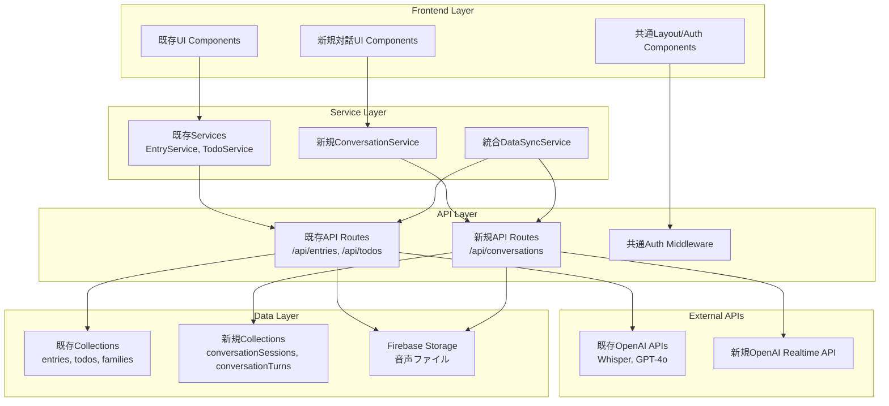

# Kinote 対話式AI システム統合設計書

**最終更新日**: 2026-02-24
**対象システム**: Kinote エンディングノートサービス
**統合機能**: OpenAI Realtime API による音声対話機能

## 統合方針

### 統合アプローチ
**段階的統合戦略**: 既存システムとの並行運用から始め、徐々に統合を深める

```
Phase 1: 並行運用（既存システム + 新対話機能）
Phase 2: 選択制統合（ユーザーが機能を選択）
Phase 3: 統合完了（シームレスな体験）
```

### 設計原則
1. **後方互換性**: 既存機能・データは一切影響を受けない
2. **段階的移行**: ユーザーの学習コストを最小化
3. **データ整合性**: 新旧システム間のデータ同期保証
4. **セキュリティ継承**: 既存のセキュリティレベルを維持・強化

---

## 1. アーキテクチャ統合設計

### 1.1 全体アーキテクチャ



### 1.2 既存システムへの影響分析

**影響なし（継続利用）:**
- Firebase Auth（認証システム）
- Firestore 既存Collections
- Next.js App Router 基盤
- 既存UI Components (Button, Card等)
- 既存API Routes

**拡張が必要:**
- Data Models（新しいフィールド追加）
- Service Layer（統合ロジック）
- Route Structure（新しいページ追加）

**新規追加:**
- WebSocket Server
- Conversation Management
- Realtime API Integration

---

## 2. データモデル統合

### 2.1 既存Entryモデル拡張

```typescript
// 既存のEntry型を拡張（破壊的変更なし）
interface ExtendedEntry extends Entry {
  // 既存フィールドは全て継続
  id: string;
  type: "question_response" | "free_diary";
  userId: string;
  familyId: string;
  transcript: string;
  summary: string;
  tags: string[];
  isImportant: boolean;
  createdAt: Timestamp;
  // ... その他既存フィールド

  // 新規追加フィールド（Optional）
  source?: 'traditional' | 'conversational';
  conversationSessionId?: string;
  extractionMethod?: 'user_input' | 'ai_analysis';
  conversationContext?: {
    relatedTurns: string[];
    extractionConfidence: number;
    originalConversationText: string;
    naturalLanguageQuery: string; // 「〇〇について話したい」
  };
}
```

### 2.2 新規Collection定義

**ConversationSessions Collection**
```typescript
interface ConversationSession {
  id: string;
  familyId: string;
  userId: string;

  // セッション基本情報
  startedAt: Timestamp;
  endedAt?: Timestamp;
  duration: number; // 秒
  status: 'active' | 'completed' | 'interrupted' | 'error';

  // 対話設定
  mode: 'guided' | 'free_conversation';
  aiPersona: 'midori' | 'custom';
  language: 'ja';
  voiceSettings: {
    voice: 'alloy' | 'echo' | 'fable' | 'onyx' | 'nova' | 'shimmer';
    speed: number; // 0.25 - 4.0（高齢者向け: 0.8-1.0推奨）
    pitch: number; // -20 - 20
  };

  // 会話成果
  extractedTopics: ConversationTopic[];
  generatedEntryIds: string[];
  overallSentiment: 'positive' | 'neutral' | 'negative';
  conversationQuality: number; // 0.0-1.0

  // 音声データ管理
  fullAudioUrl?: string;
  transcriptSummary: string;
  privacySettings: {
    saveAudio: boolean;
    shareFull: boolean; // 家族との完全共有
    sharePartial: boolean; // 抽出情報のみ共有
  };

  // 技術データ
  networkQuality: 'good' | 'medium' | 'poor';
  averageLatency: number;
  errorCount: number;
  clientInfo: {
    userAgent: string;
    deviceType: 'mobile' | 'desktop';
    browserVersion: string;
  };
}

interface ConversationTopic {
  category: 'money' | 'medical' | 'funeral' | 'house' | 'memories' | 'digital';
  confidence: number;
  keyPoints: string[];
  relatedQuestionIds: string[]; // 53質問との対応
  discussedThoroughly: boolean;
}
```

**ConversationTurns Collection**
```typescript
interface ConversationTurn {
  id: string;
  sessionId: string;
  turnNumber: number;

  // 基本ターン情報
  type: 'user' | 'assistant';
  content: string;
  timestamp: Timestamp;
  duration?: number; // 音声の長さ

  // 音声関連
  audioUrl?: string;
  audioQuality?: number; // 0.0-1.0
  recognitionConfidence?: number; // 音声認識信頼度

  // AI分析結果（ユーザーターンの場合）
  aiAnalysis?: {
    intent: string; // 「質問」「情報提供」「雑談」など
    entities: string[]; // 抽出された固有名詞
    sentiment: 'positive' | 'neutral' | 'negative';
    topics: string[];
    importanceScore: number; // 0.0-1.0

    // 終活関連分析
    endOfLifeRelevance: {
      category?: 'money' | 'medical' | 'funeral' | 'house' | 'memories' | 'digital';
      relevanceScore: number; // 0.0-1.0
      suggestedFollowUp: string[];
      shouldCreateEntry: boolean;
    };
  };

  // コンテキスト
  conversationContext: {
    previousTurnId?: string;
    threadTopic?: string; // 現在の話題の流れ
    userEmotionalState?: 'engaged' | 'hesitant' | 'confused' | 'upset';
  };
}
```

### 2.3 データ同期戦略

```typescript
// 対話→エントリー変換サービス
export class ConversationToEntrySync {

  async syncSessionToEntries(sessionId: string): Promise<Entry[]> {
    const session = await ConversationRepository.getSession(sessionId);
    const turns = await ConversationRepository.getTurns(sessionId);

    const createdEntries: Entry[] = [];

    // 各トピックごとにエントリ作成
    for (const topic of session.extractedTopics) {
      if (topic.discussedThoroughly && topic.confidence > 0.7) {

        const entry = await this.createEntryFromTopic(
          session,
          topic,
          turns
        );

        createdEntries.push(entry);
      }
    }

    // セッション完了時に自動実行
    await this.updateSessionWithGeneratedEntries(sessionId, createdEntries);

    return createdEntries;
  }

  private async createEntryFromTopic(
    session: ConversationSession,
    topic: ConversationTopic,
    turns: ConversationTurn[]
  ): Promise<Entry> {

    // 関連するターンを抽出
    const relevantTurns = turns.filter(turn =>
      turn.aiAnalysis?.endOfLifeRelevance.category === topic.category &&
      turn.aiAnalysis?.endOfLifeRelevance.relevanceScore > 0.5
    );

    // 会話内容を要約
    const conversationText = relevantTurns
      .filter(turn => turn.type === 'user')
      .map(turn => turn.content)
      .join('\n');

    // AI要約生成
    const summary = await SummarizationService.summarizeConversation(
      conversationText,
      topic.category
    );

    // エントリ作成
    return await EntryRepository.create({
      type: 'conversational_extract',
      userId: session.userId,
      familyId: session.familyId,
      transcript: conversationText,
      summary: summary,
      tags: [topic.category],
      isImportant: topic.confidence > 0.9,

      // 対話固有フィールド
      source: 'conversational',
      conversationSessionId: session.id,
      extractionMethod: 'ai_analysis',
      conversationContext: {
        relatedTurns: relevantTurns.map(t => t.id),
        extractionConfidence: topic.confidence,
        originalConversationText: conversationText,
        naturalLanguageQuery: `${topic.category}について話しました`
      }
    });
  }
}
```

---

## 3. API統合設計

### 3.1 新規APIエンドポイント

```typescript
// /api/conversations/* - 新規対話API群

/**
 * POST /api/conversations
 * 新しい対話セッション開始
 */
export async function POST(request: Request) {
  const { familyId, mode, voiceSettings } = await request.json();
  const userId = await getUserIdFromAuth(request);

  // プラン制限チェック
  await validateConversationAccess(userId);

  const session = await ConversationService.createSession({
    userId,
    familyId,
    mode,
    voiceSettings,
    startedAt: serverTimestamp(),
    status: 'active'
  });

  return NextResponse.json({ sessionId: session.id });
}

/**
 * GET/PUT /api/conversations/[sessionId]
 * セッション管理（取得・更新・終了）
 */
export async function GET(
  request: Request,
  { params }: { params: { sessionId: string } }
) {
  const { sessionId } = params;
  const userId = await getUserIdFromAuth(request);

  const session = await ConversationService.getSession(sessionId);

  // アクセス権限チェック
  if (session.userId !== userId) {
    return new Response('Unauthorized', { status: 403 });
  }

  return NextResponse.json(session);
}

export async function PUT(
  request: Request,
  { params }: { params: { sessionId: string } }
) {
  const { sessionId } = params;
  const updates = await request.json();

  const updatedSession = await ConversationService.updateSession(
    sessionId,
    updates
  );

  return NextResponse.json(updatedSession);
}

/**
 * POST /api/conversations/[sessionId]/turns
 * 会話ターン追加
 */
export async function POST(
  request: Request,
  { params }: { params: { sessionId: string } }
) {
  const { sessionId } = params;
  const { type, content, audioBlob } = await request.json();

  const turn = await ConversationService.addTurn(sessionId, {
    type,
    content,
    audioBlob,
    timestamp: serverTimestamp()
  });

  return NextResponse.json(turn);
}

/**
 * POST /api/conversations/[sessionId]/sync
 * 対話内容をエントリに変換・同期
 */
export async function POST(
  request: Request,
  { params }: { params: { sessionId: string } }
) {
  const { sessionId } = params;
  const { autoSync } = await request.json();

  const entries = await ConversationToEntrySync.syncSessionToEntries(sessionId);

  return NextResponse.json({
    syncedEntries: entries,
    totalEntries: entries.length
  });
}
```

### 3.2 WebSocket統合

```typescript
// WebSocket Server for Real-time Communication
// app/src/lib/websocket/ConversationWebSocketServer.ts

export class ConversationWebSocketServer {
  private wss: WebSocketServer;
  private activeSessions: Map<string, ConversationSessionState>;

  constructor() {
    this.wss = new WebSocketServer({
      port: process.env.WEBSOCKET_PORT || 8080
    });
    this.activeSessions = new Map();
  }

  async initialize() {
    this.wss.on('connection', (ws, request) => {
      this.handleNewConnection(ws, request);
    });
  }

  private async handleNewConnection(
    ws: WebSocket,
    request: IncomingMessage
  ) {
    // 認証チェック
    const token = this.extractAuthToken(request);
    const user = await this.validateAuthToken(token);

    if (!user) {
      ws.close(4001, 'Unauthorized');
      return;
    }

    // セッション作成/復元
    const sessionId = this.extractSessionId(request);
    const sessionState = await this.getOrCreateSession(sessionId, user);

    this.activeSessions.set(ws.id, sessionState);

    // OpenAI Realtime API接続
    const openaiWs = await this.createOpenAIConnection(sessionState);

    // 双方向通信セットアップ
    this.setupBidirectionalForwarding(ws, openaiWs, sessionState);

    ws.on('close', () => {
      this.handleDisconnection(ws.id, sessionState);
    });
  }

  private setupBidirectionalForwarding(
    clientWs: WebSocket,
    openaiWs: WebSocket,
    sessionState: ConversationSessionState
  ) {
    // クライアント → OpenAI
    clientWs.on('message', async (data) => {
      try {
        const message = JSON.parse(data.toString());

        // メッセージの前処理（ログ、フィルタリング等）
        await this.preprocessClientMessage(message, sessionState);

        // OpenAIに転送
        openaiWs.send(JSON.stringify(message));

      } catch (error) {
        this.handleError(clientWs, error, sessionState);
      }
    });

    // OpenAI → クライアント
    openaiWs.on('message', async (data) => {
      try {
        const message = JSON.parse(data.toString());

        // メッセージの後処理（分析、保存等）
        await this.postprocessAIMessage(message, sessionState);

        // クライアントに転送
        clientWs.send(JSON.stringify(message));

      } catch (error) {
        this.handleError(clientWs, error, sessionState);
      }
    });
  }

  private async postprocessAIMessage(
    message: any,
    sessionState: ConversationSessionState
  ) {
    // 会話ターンとして保存
    if (message.type === 'response.audio_transcript.done') {
      await ConversationService.saveTurn(sessionState.sessionId, {
        type: 'assistant',
        content: message.transcript,
        timestamp: serverTimestamp(),
        metadata: message
      });
    }

    // リアルタイム分析
    if (message.type === 'conversation.item.created') {
      await this.analyzeConversationTurn(message, sessionState);
    }
  }

  private async analyzeConversationTurn(
    message: any,
    sessionState: ConversationSessionState
  ) {
    const userMessage = message.item?.content?.find(
      c => c.type === 'input_text'
    )?.text;

    if (userMessage) {
      // 終活情報の抽出分析
      const analysis = await ConversationAnalyzer.analyzeUserMessage(
        userMessage,
        sessionState.conversationContext
      );

      // 重要な情報が見つかった場合、即座にエントリ候補として保存
      if (analysis.endOfLifeRelevance.shouldCreateEntry) {
        await this.createEntryCandidate(analysis, sessionState);
      }
    }
  }
}
```

### 3.3 認証・権限統合

```typescript
// 既存認証システムとの統合
// app/src/middleware/conversationAuth.ts

export async function validateConversationAccess(
  userId: string,
  familyId: string,
  sessionId?: string
): Promise<ConversationPermissions> {

  // 基本認証チェック（既存システム）
  const user = await getUserById(userId);
  const family = await getFamilyById(familyId);

  if (user.currentFamilyId !== familyId) {
    throw new Error('Family access denied');
  }

  // プラン制限チェック
  const subscription = user.subscription;
  const monthlyUsage = await getConversationUsage(userId);

  const planLimits = {
    free: { monthlyMinutes: 30, concurrentSessions: 1 },
    conversational: { monthlyMinutes: 120, concurrentSessions: 2 },
    premium: { monthlyMinutes: 300, concurrentSessions: 3 }
  };

  const limits = planLimits[subscription?.plan || 'free'];

  if (monthlyUsage.totalMinutes >= limits.monthlyMinutes) {
    throw new Error('Monthly usage limit exceeded');
  }

  const activeSessions = await getActiveConversationSessions(userId);
  if (activeSessions.length >= limits.concurrentSessions) {
    throw new Error('Too many concurrent sessions');
  }

  return {
    canStartSession: true,
    remainingMinutes: limits.monthlyMinutes - monthlyUsage.totalMinutes,
    canRecord: true,
    canShare: family.members.length > 1
  };
}

interface ConversationPermissions {
  canStartSession: boolean;
  remainingMinutes: number;
  canRecord: boolean;
  canShare: boolean;
}
```

---

## 4. UI統合設計

### 4.1 ページ構成統合

```typescript
// 新規ページ追加（既存ページ構造を継承）
const pageStructure = {
  // 既存ページ（継続）
  existing: [
    '/record', // 従来の録音方式
    '/dashboard', // ダッシュボード
    '/dashboard/entries', // エントリ一覧
    '/dashboard/todo', // ToDo管理
    // ... その他既存ページ
  ],

  // 新規追加ページ
  new: [
    '/conversation', // 対話メイン画面
    '/conversation/settings', // 対話設定
    '/conversation/history', // 対話履歴
    '/conversation/[sessionId]', // 個別セッション詳細
  ],

  // 機能統合ページ（既存ページの拡張）
  integrated: [
    '/dashboard', // 対話進捗も表示
    '/dashboard/entries', // 対話由来エントリも表示
    '/dashboard/settings', // 対話設定項目を追加
  ]
};
```

### 4.2 コンポーネント統合戦略

```typescript
// 共通コンポーネントの再利用
// app/src/components/layouts/DashboardLayout.tsx（既存）
export function DashboardLayout({ children }: { children: ReactNode }) {
  // 既存のレイアウトに対話関連ナビゲーション追加
  return (
    <div className="min-h-screen bg-gray-50">
      <Sidebar>
        {/* 既存メニュー */}
        <SidebarItem href="/dashboard" icon={HomeIcon}>ホーム</SidebarItem>
        <SidebarItem href="/record" icon={MicrophoneIcon}>録音する</SidebarItem>

        {/* 新規追加メニュー */}
        <SidebarItem href="/conversation" icon={ChatIcon}>AIとお話</SidebarItem>

        {/* 既存メニュー続き */}
        <SidebarItem href="/dashboard/entries" icon={DocumentIcon}>記録一覧</SidebarItem>
        {/* ... */}
      </Sidebar>

      <main className="ml-64 p-8">
        {children}
      </main>
    </div>
  );
}

// 新規コンポーネント
// app/src/components/features/conversation/ConversationInterface.tsx
export function ConversationInterface() {
  const { user } = useAuth(); // 既存認証Hook使用
  const { family } = useFamily(); // 既存家族管理Hook使用
  const { conversation, connect, start } = useRealtimeConversation(); // 新規Hook

  return (
    <DashboardLayout> {/* 既存レイアウト使用 */}
      <div className="max-w-4xl mx-auto">
        <PageHeader
          title="AIとお話する"
          subtitle="みどりさんとお話しして、エンディングノートを作成しましょう"
        />

        <ConversationMainArea />
        <ConversationHistory />
        <ConversationSettings />
      </div>
    </DashboardLayout>
  );
}

// 統合されたダッシュボード
// app/src/app/(child)/dashboard/page.tsx（拡張）
export default function DashboardPage() {
  const { user } = useAuth();
  const { progress } = useProgress(); // 既存進捗Hook
  const { conversationSessions } = useConversationHistory(); // 新規Hook

  return (
    <DashboardLayout>
      {/* 既存セクション */}
      <ProgressOverview progress={progress} />
      <QuickActions />

      {/* 新規追加セクション */}
      <ConversationStatusCard sessions={conversationSessions} />

      {/* 既存セクション */}
      <RecentEntries />
      <FamilyActivity />
    </DashboardLayout>
  );
}
```

### 4.3 レスポンシブ対応統合

```typescript
// 既存のモバイル対応を継承
// app/src/components/features/conversation/ConversationMobile.tsx
export function ConversationMobile() {
  return (
    <div className="min-h-screen bg-gray-50 p-4 md:hidden">
      {/* モバイル専用の対話UI */}
      <MobileConversationHeader />
      <MobileConversationButton />
      <MobileConversationStatus />
    </div>
  );
}

export function ConversationDesktop() {
  return (
    <div className="hidden md:flex min-h-screen">
      {/* デスクトップ専用の対話UI */}
      <DesktopConversationSidebar />
      <DesktopConversationMain />
    </div>
  );
}

// 統合コンポーネント
export function ConversationInterface() {
  return (
    <>
      <ConversationMobile />
      <ConversationDesktop />
    </>
  );
}
```

---

## 5. テスト戦略統合

### 5.1 既存テストへの影響

```typescript
// 既存テストは影響を受けない
// app/src/__tests__/services/EntryService.test.ts（既存）
describe('EntryService', () => {
  // 既存テストはそのまま継続
  it('should create entry from audio', async () => {
    // 既存のテストケース
  });

  // 新規追加テスト
  it('should create entry from conversation', async () => {
    const conversationData = {
      sessionId: 'test-session',
      turns: mockConversationTurns,
      extractedInfo: mockExtractedInfo
    };

    const entry = await EntryService.createFromConversation(conversationData);

    expect(entry.source).toBe('conversational');
    expect(entry.conversationSessionId).toBe('test-session');
  });
});
```

### 5.2 統合テスト計画

```typescript
// 新規統合テストスイート
// app/src/__tests__/integration/ConversationIntegration.test.ts
describe('Conversation-Entry Integration', () => {

  it('should sync conversation to entries correctly', async () => {
    // 1. 対話セッション作成
    const session = await ConversationService.createSession({
      userId: 'test-user',
      familyId: 'test-family'
    });

    // 2. 対話ターン追加
    await ConversationService.addTurn(session.id, {
      type: 'user',
      content: '○○銀行に口座があります'
    });

    // 3. 同期実行
    const entries = await ConversationToEntrySync.syncSessionToEntries(session.id);

    // 4. 検証
    expect(entries).toHaveLength(1);
    expect(entries[0].tags).toContain('money');
    expect(entries[0].source).toBe('conversational');
  });

  it('should maintain data consistency between systems', async () => {
    // 既存システムでエントリ作成
    const traditionalEntry = await EntryService.createFromAudio(mockAudioBlob);

    // 対話システムで同一情報作成
    const conversationEntry = await EntryService.createFromConversation(mockConversationData);

    // データの一貫性確認
    expect(traditionalEntry.familyId).toBe(conversationEntry.familyId);
    expect(traditionalEntry.userId).toBe(conversationEntry.userId);
  });
});
```

### 5.3 E2Eテスト統合

```typescript
// app/src/__tests__/e2e/conversation-flow.spec.ts
import { test, expect } from '@playwright/test';

test.describe('Conversation Feature Integration', () => {

  test('should work alongside traditional recording', async ({ page }) => {
    await page.goto('/dashboard');

    // 既存機能の確認
    await page.click('[data-testid="traditional-record-button"]');
    await expect(page).toHaveURL('/record');

    // 新機能の確認
    await page.goto('/dashboard');
    await page.click('[data-testid="conversation-button"]');
    await expect(page).toHaveURL('/conversation');

    // 両方の機能で作成されたエントリが統合表示されることを確認
    await page.goto('/dashboard/entries');
    await expect(page.locator('[data-entry-source="traditional"]')).toBeVisible();
    await expect(page.locator('[data-entry-source="conversational"]')).toBeVisible();
  });
});
```

---

## 6. セキュリティ統合

### 6.1 認証・認可の継承

```typescript
// 既存セキュリティレベルの継承・強化
// app/src/lib/auth/ConversationSecurity.ts

export class ConversationSecurity {

  static async validateSessionAccess(
    sessionId: string,
    userId: string
  ): Promise<boolean> {
    // 既存の認証チェック機能を活用
    const user = await getUserById(userId);
    if (!user) return false;

    const session = await ConversationRepository.getSession(sessionId);

    // セッション所有者チェック
    if (session.userId !== userId) return false;

    // 家族メンバーシップチェック（既存ロジック）
    const hasAccess = await checkFamilyAccess(userId, session.familyId);
    return hasAccess;
  }

  static async sanitizeConversationData(
    turns: ConversationTurn[]
  ): Promise<ConversationTurn[]> {
    return turns.map(turn => ({
      ...turn,
      content: this.sanitizeSensitiveInfo(turn.content)
    }));
  }

  private static sanitizeSensitiveInfo(content: string): string {
    // 既存のサニタイゼーション機能を活用
    return content
      .replace(/\d{4}-?\d{4}/g, '[REDACTED]') // カード番号
      .replace(/暗証番号.*?\d+/g, '[REDACTED]') // 暗証番号
      .replace(/パスワード.*?[^\s]+/g, '[REDACTED]'); // パスワード
  }
}
```

### 6.2 データ保護の強化

```typescript
// app/src/lib/security/ConversationDataProtection.ts
export class ConversationDataProtection {

  static async encryptConversationAudio(
    audioBlob: Blob,
    sessionId: string
  ): Promise<EncryptedAudioData> {
    // 既存の暗号化機能を活用・強化
    const key = await this.generateSessionKey(sessionId);

    const encrypted = await crypto.subtle.encrypt(
      { name: 'AES-GCM', iv: crypto.getRandomValues(new Uint8Array(12)) },
      key,
      await audioBlob.arrayBuffer()
    );

    return { encrypted, keyId: sessionId };
  }

  static async handleDataRetention(
    sessionId: string,
    userPreferences: DataRetentionPreferences
  ): Promise<void> {
    // ユーザーの選択に基づくデータ保持ポリシー
    switch (userPreferences.audioRetention) {
      case 'none':
        await this.scheduleImmediateDeletion(sessionId);
        break;
      case '24h':
        await this.scheduleDelayedDeletion(sessionId, '24h');
        break;
      case 'permanent':
        await this.markForPermanentStorage(sessionId);
        break;
    }

    // GDPR等コンプライアンス対応
    await this.recordConsentDecision(sessionId, userPreferences);
  }
}

interface DataRetentionPreferences {
  audioRetention: 'none' | '24h' | '7d' | 'permanent';
  transcriptRetention: 'none' | '1y' | 'permanent';
  familySharing: boolean;
  consentTimestamp: Timestamp;
}
```

---

## 7. パフォーマンス統合

### 7.1 既存システムへの影響最小化

```typescript
// パフォーマンス分離戦略
export class PerformanceIsolation {

  // 対話機能は別プロセス/ワーカーで実行
  static async initializeConversationWorker(): Promise<Worker> {
    const worker = new Worker('/workers/conversation-worker.js');

    // 既存システムのリソースと分離
    worker.postMessage({
      type: 'INITIALIZE',
      config: {
        apiKeys: process.env.OPENAI_API_KEY,
        isolatedMemoryLimit: '512MB',
        cpuPriorityLow: true // 既存機能を優先
      }
    });

    return worker;
  }

  // リソース監視・制御
  static async monitorResourceUsage(): Promise<ResourceMetrics> {
    const metrics = {
      conversationMemoryUsage: process.memoryUsage().heapUsed,
      activeWebSocketConnections: WebSocketServer.getActiveCount(),
      openaiApiLatency: await this.measureOpenAILatency()
    };

    // 既存システムに影響がある場合は対話機能を制限
    if (metrics.conversationMemoryUsage > MEMORY_THRESHOLD) {
      await this.throttleConversationSessions();
    }

    return metrics;
  }
}
```

### 7.2 キャッシュ統合戦略

```typescript
// 既存キャッシュシステムとの統合
// app/src/lib/cache/ConversationCache.ts
export class ConversationCache {

  static async cacheFrequentPrompts(): Promise<void> {
    // よく使われる対話プロンプトをキャッシュ
    const commonPrompts = [
      'greeting_patterns',
      'endoflife_transition_phrases',
      'error_recovery_responses'
    ];

    for (const promptType of commonPrompts) {
      await Redis.setex(
        `conversation:prompts:${promptType}`,
        3600, // 1時間
        await this.loadPromptTemplate(promptType)
      );
    }
  }

  static async cacheSessionState(
    sessionId: string,
    state: ConversationState
  ): Promise<void> {
    // セッション状態を Redis にキャッシュ
    await Redis.setex(
      `conversation:session:${sessionId}`,
      1800, // 30分
      JSON.stringify(state)
    );
  }

  // 既存のエントリキャッシュと統合
  static async invalidateRelatedCaches(sessionId: string): Promise<void> {
    const session = await this.getCachedSession(sessionId);

    // 対話で作成されたエントリに関連するキャッシュをクリア
    if (session?.generatedEntryIds) {
      for (const entryId of session.generatedEntryIds) {
        await Cache.invalidate(`entry:${entryId}`);
        await Cache.invalidate(`entries:user:${session.userId}`);
        await Cache.invalidate(`entries:family:${session.familyId}`);
      }
    }
  }
}
```

---

## 8. 監視・ロギング統合

### 8.1 既存監視システム拡張

```typescript
// app/src/lib/monitoring/ConversationMonitoring.ts
export class ConversationMonitoring {

  static async logConversationMetrics(
    sessionId: string,
    metrics: ConversationMetrics
  ): Promise<void> {
    // 既存のログシステム（Firestore logs）に統合
    await firestore.collection('system_logs').add({
      type: 'conversation_session',
      sessionId,
      timestamp: serverTimestamp(),

      // 対話固有メトリクス
      duration: metrics.duration,
      turnCount: metrics.turnCount,
      averageLatency: metrics.averageLatency,
      errorRate: metrics.errorRate,

      // 品質メトリクス
      speechRecognitionAccuracy: metrics.speechRecognitionAccuracy,
      informationExtractionSuccess: metrics.informationExtractionSuccess,
      userSatisfactionScore: metrics.userSatisfactionScore,

      // 技術メトリクス
      networkQuality: metrics.networkQuality,
      audioQuality: metrics.audioQuality,
      apiResponseTimes: metrics.apiResponseTimes
    });
  }

  static async alertOnAnomalies(
    sessionId: string,
    anomaly: ConversationAnomaly
  ): Promise<void> {
    // 既存のアラートシステムと統合
    switch (anomaly.severity) {
      case 'high':
        await NotificationService.sendSlackAlert({
          channel: '#kinote-alerts',
          message: `🚨 Conversation anomaly detected: ${anomaly.description}`,
          sessionId,
          priority: 'high'
        });
        break;

      case 'medium':
        await NotificationService.logWarning({
          type: 'conversation_anomaly',
          sessionId,
          description: anomaly.description
        });
        break;
    }
  }
}

interface ConversationMetrics {
  duration: number;
  turnCount: number;
  averageLatency: number;
  errorRate: number;
  speechRecognitionAccuracy: number;
  informationExtractionSuccess: number;
  userSatisfactionScore: number;
  networkQuality: 'good' | 'medium' | 'poor';
  audioQuality: number;
  apiResponseTimes: number[];
}
```

### 8.2 ビジネスメトリクス統合

```typescript
// 既存のビジネスメトリクス収集に対話指標を追加
// app/src/lib/analytics/ConversationAnalytics.ts
export class ConversationAnalytics {

  static async trackConversationUsage(
    userId: string,
    sessionData: ConversationSession
  ): Promise<void> {
    // 既存の使用状況分析に統合
    await AnalyticsService.track('conversation_session_completed', {
      userId,
      familyId: sessionData.familyId,
      duration: sessionData.duration,
      entriesGenerated: sessionData.generatedEntryIds.length,
      conversationQuality: sessionData.conversationQuality,

      // プラン・収益分析
      userPlan: await getUserPlan(userId),
      estimatedCost: this.calculateSessionCost(sessionData),

      // UXメトリクス
      userSatisfaction: sessionData.userSatisfactionScore,
      technicalQuality: sessionData.averageLatency < 2000 ? 'good' : 'poor'
    });
  }

  static async generateConversationInsights(): Promise<ConversationInsights> {
    // 既存のダッシュボード分析に対話データを統合
    const insights = await AnalyticsService.query(`
      SELECT
        COUNT(*) as total_conversations,
        AVG(duration) as avg_duration,
        AVG(conversationQuality) as avg_quality,
        SUM(entriesGenerated) as total_entries_from_conversations
      FROM conversation_sessions
      WHERE createdAt > DATE_SUB(NOW(), INTERVAL 30 DAY)
    `);

    return {
      monthlyConversations: insights.total_conversations,
      averageSessionDuration: insights.avg_duration,
      averageConversationQuality: insights.avg_quality,
      conversationToEntryRate: insights.total_entries_from_conversations / insights.total_conversations
    };
  }
}
```

---

## 9. デプロイメント統合

### 9.1 段階的デプロイメント戦略

```typescript
// デプロイメント設定
const deploymentStrategy = {
  phase1: {
    target: "社内テストユーザー（5名）",
    duration: "2週間",
    features: ["基本対話機能", "既存システム並行動作確認"],
    rollback: "機能フラグでのインスタント無効化"
  },

  phase2: {
    target: "ベータテストユーザー（50名）",
    duration: "4週間",
    features: ["全対話機能", "データ同期検証"],
    criteria: "エラー率<5%, 満足度>4.0"
  },

  phase3: {
    target: "有料プランユーザー（500名）",
    duration: "8週間",
    features: ["本格運用", "負荷テスト"],
    monitoring: "24/7監視体制"
  },

  phase4: {
    target: "全ユーザー",
    duration: "継続",
    features: ["一般提供"],
    support: "フルサポート体制"
  }
};
```

### 9.2 フィーチャーフラグ統合

```typescript
// app/src/lib/featureFlags/ConversationFlags.ts
export class ConversationFeatureFlags {

  static async isConversationEnabled(userId: string): Promise<boolean> {
    // 既存のフィーチャーフラグシステムと統合
    const userFeatureFlags = await FeatureFlagService.getUserFlags(userId);

    // 段階的ロールアウト条件
    const conditions = [
      userFeatureFlags.conversation_enabled,
      await this.checkUserEligibility(userId),
      await this.checkSystemCapacity()
    ];

    return conditions.every(condition => condition === true);
  }

  private static async checkUserEligibility(userId: string): Promise<boolean> {
    const user = await getUserById(userId);

    // ベータテストグループかどうか
    if (user.betaPrograms?.includes('conversation_beta')) return true;

    // 有料プランユーザーかどうか
    if (user.subscription?.plan !== 'free') return true;

    // 段階的公開の対象かどうか
    const rolloutPercentage = await FeatureFlagService.getRolloutPercentage('conversation');
    const userHash = this.hashUserId(userId);

    return userHash % 100 < rolloutPercentage;
  }

  static async checkSystemCapacity(): Promise<boolean> {
    const metrics = await SystemMetrics.getCurrent();

    // システム負荷が高い場合は新機能を制限
    return metrics.cpuUsage < 80 && metrics.memoryUsage < 85;
  }
}
```

---

## 10. 継続的統合・改善

### 10.1 統合後の品質保証

```typescript
// 統合品質の継続監視
export class IntegrationQualityAssurance {

  static async runDailyContinuityChecks(): Promise<QualityReport> {
    const checks = await Promise.allSettled([
      this.verifyDataConsistency(),
      this.checkCrossSystemFunctionality(),
      this.validatePerformanceImpact(),
      this.confirmSecurityIntegrity()
    ]);

    const report: QualityReport = {
      timestamp: new Date(),
      dataConsistency: this.getCheckResult(checks[0]),
      crossSystemFunctionality: this.getCheckResult(checks[1]),
      performanceImpact: this.getCheckResult(checks[2]),
      securityIntegrity: this.getCheckResult(checks[3]),
      overallHealth: this.calculateOverallHealth(checks)
    };

    if (report.overallHealth < 0.95) {
      await this.triggerQualityAlert(report);
    }

    return report;
  }

  private static async verifyDataConsistency(): Promise<ConsistencyCheckResult> {
    // 対話データと既存エントリの整合性確認
    const inconsistencies = await db.query(`
      SELECT cs.id as sessionId,
             cs.generatedEntryIds,
             count(e.id) as actualEntries
      FROM conversation_sessions cs
      LEFT JOIN entries e ON e.conversationSessionId = cs.id
      GROUP BY cs.id
      HAVING count(e.id) != json_length(cs.generatedEntryIds)
    `);

    return {
      passed: inconsistencies.length === 0,
      inconsistencies: inconsistencies.length,
      details: inconsistencies
    };
  }
}
```

### 10.2 ユーザーフィードバック統合

```typescript
// 統合されたフィードバック収集システム
export class IntegratedFeedbackSystem {

  static async collectConversationFeedback(
    sessionId: string,
    feedback: ConversationFeedback
  ): Promise<void> {
    // 既存フィードバックシステムに統合
    await FeedbackService.submit({
      type: 'conversation_session',
      sessionId,
      userId: feedback.userId,

      // 対話固有フィードバック
      conversationNaturalness: feedback.naturalness,
      aiPersonaLikability: feedback.aiPersona,
      informationExtractionAccuracy: feedback.extractionAccuracy,
      overallSatisfaction: feedback.overallSatisfaction,

      // 統合体験フィードバック
      comparedToTraditionalMethod: feedback.comparisonToTraditional,
      featureIntegrationSmoothness: feedback.integrationSmoothness,

      // 自由記述
      comments: feedback.comments,
      suggestions: feedback.suggestions
    });
  }

  static async analyzeIntegrationSuccess(): Promise<IntegrationSuccessMetrics> {
    // 統合成功の指標分析
    const metrics = await AnalyticsService.query(`
      SELECT
        AVG(CASE WHEN f.comparedToTraditionalMethod > 3 THEN 1 ELSE 0 END) as preferenceRate,
        AVG(f.integrationSmoothness) as smoothnessScore,
        AVG(f.overallSatisfaction) as satisfactionScore,
        COUNT(CASE WHEN f.overallSatisfaction >= 4 THEN 1 END) / COUNT(*) as recommendationRate
      FROM feedback f
      WHERE f.type = 'conversation_session'
        AND f.createdAt > DATE_SUB(NOW(), INTERVAL 30 DAY)
    `);

    return {
      userPreferenceRate: metrics.preferenceRate,
      integrationSmoothness: metrics.smoothnessScore,
      overallSatisfaction: metrics.satisfactionScore,
      recommendationRate: metrics.recommendationRate,

      // 成功判定
      integrationSuccessful: metrics.preferenceRate > 0.6 &&
                           metrics.smoothnessScore > 4.0 &&
                           metrics.satisfactionScore > 4.0
    };
  }
}
```

---

## まとめ

この統合設計書により、既存のKinoteシステムに対話式AI機能をシームレスに統合することが可能になります。

### 統合の重要ポイント

1. **非破壊的統合**: 既存機能・データに一切影響を与えない設計
2. **段階的移行**: ユーザーが自分のペースで新機能に慣れ親しめる
3. **品質保証**: 既存システムの安定性を維持しつつ新機能を提供
4. **スケーラビリティ**: 将来的な機能拡張に対応できる柔軟な設計

### 実装完了後の期待効果

- **ユーザー体験の革新**: テキスト→音声から自然な対話への転換
- **情報収集効率**: 従来の53質問方式を自然な会話に統合
- **技術的安定性**: 既存システムの安定性を保ちつつ革新的機能を提供
- **事業価値向上**: 新しいプラン体系による収益向上とユーザー満足度向上

この統合により、Kinoteは真の意味で「AIと作る終活ノート」として、エンディングノート業界に新たなスタンダードを確立することができます。