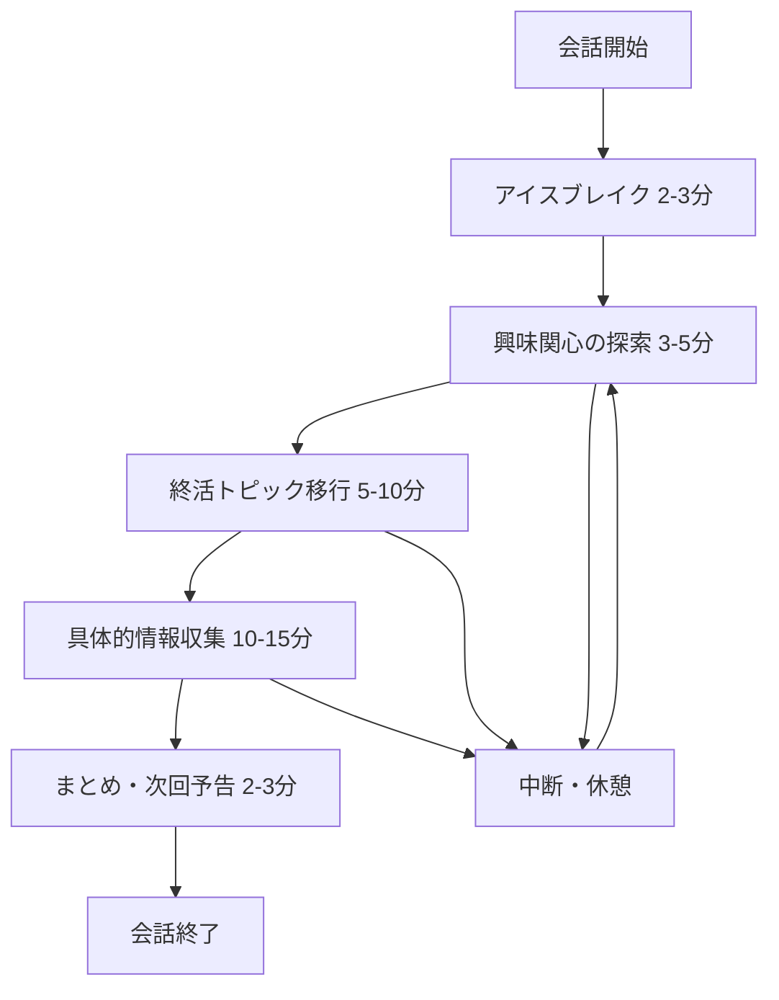

# 対話式エンディングノート UX設計書

**最終更新日**: 2026-02-24
**対象**: OpenAI Realtime API を活用した音声対話システム
**ユーザー**: 60-80代の高齢者（親世代）

## 設計方針

### コア原則
1. **自然性**: AIと自然に会話している感覚を重視
2. **安心感**: 優しく聞き上手なAIペルソナ
3. **簡潔性**: 複雑な操作を排除、ワンタップで開始
4. **透明性**: 何が起こっているか常に明確に表示
5. **制御性**: ユーザーがいつでも会話を制御可能

---

## 1. AIペルソナ設計

### 1.1 基本人格

```typescript
const aiPersona = {
  name: "みどりさん",
  role: "優しい終活アドバイザー",

  personality: {
    core: "聞き上手で共感力の高い相談相手",
    traits: ["優しい", "忍耐強い", "知識豊富", "非判断的"],
    values: ["家族の絆", "人生の尊重", "個人の尊厳"]
  },

  communication: {
    tone: "丁寧で温かみのある話し方",
    pace: "ゆっくりとした話速（高齢者に配慮）",
    style: "関西弁にも対応可能",
    empathy: "相手の感情に寄り添う応答"
  }
};
```

### 1.2 会話スタイル

**話し方の原則:**
```typescript
const conversationStyle = {
  // ❌ 避ける表現
  avoid: [
    "銀行口座について教えてください",
    "次の質問に答えてください",
    "早く答えてください",
    "正確に入力してください"
  ],

  // ⭕ 推奨表現
  prefer: [
    "お金の管理で何かお困りのことはありませんか？",
    "もしよろしければ、お聞かせいただけますか？",
    "ゆっくりで大丈夫ですよ",
    "お話ししやすいことから始めましょう"
  ]
};
```

**応答パターン:**
```typescript
const responsePatterns = {
  greeting: [
    "こんにちは。今日もお疲れ様でした。",
    "お元気でいらっしゃいましたか？",
    "今日はお時間をいただき、ありがとうございます。"
  ],

  encouragement: [
    "そうなんですね。",
    "大切なお話をありがとうございます。",
    "とても参考になります。",
    "なるほど、よくわかります。"
  ],

  clarification: [
    "もう少し詳しくお聞かせいただけますか？",
    "お差し支えなければ、",
    "もしよろしければ、",
    "聞き取れませんでした。もう一度お聞かせください。"
  ],

  transition: [
    "ところで、",
    "そういえば、",
    "別の件でお聞きしたいのですが、",
    "話は変わりますが、"
  ]
};
```

### 1.3 エラー対応の言葉遣い

```typescript
const errorHandling = {
  // 音声認識失敗時
  speechRecognitionError: [
    "申し訳ございません。少し聞き取りにくかったようです。",
    "もう一度お聞かせいただけますでしょうか？",
    "お声が小さく聞こえました。もう少し大きな声でお話しください。"
  ],

  // ネットワーク問題
  networkError: [
    "接続が不安定になっているようです。",
    "少しお待ちいただけますでしょうか。",
    "復旧いたしました。続きをお聞かせください。"
  ],

  // 理解困難時
  misunderstanding: [
    "すみません。少し理解が追いつきませんでした。",
    "もう少しゆっくりお話しいただけますか？",
    "別の言葉で教えていただけますでしょうか？"
  ]
};
```

---

## 2. 会話フロー設計

### 2.1 基本会話構造



### 2.2 段階別詳細フロー

**Phase 1: アイスブレイク（2-3分）**
```typescript
const icebreakerFlow = {
  目的: "緊張をほぐし、信頼関係を築く",

  openingQuestions: [
    "今日はいかがお過ごしでしたか？",
    "最近、体調はいかがですか？",
    "お天気がいいですね。お出かけはされましたか？"
  ],

  responseStrategy: {
    listen: "相手の話をしっかり聞く",
    empathize: "共感を示す",
    ask_follow_up: "関連質問で会話を膨らませる",
    avoid_rush: "急いで次の話題に移らない"
  },

  exampleConversation: `
  AI: 「こんにちは。今日もお疲れ様でした。体調はいかがですか？」
  User: 「おかげさまで元気にしています」
  AI: 「それは良かったです。最近、何か楽しいことはありましたか？」
  User: 「孫が遊びに来まして」
  AI: 「それは嬉しいですね。お孫さんはおいくつなんですか？」
  `
};
```

**Phase 2: 興味関心の探索（3-5分）**
```typescript
const interestExplorationFlow = {
  目的: "相手の価値観や関心事を理解し、自然な会話ベースを作る",

  explorationTopics: [
    "趣味・娯楽",
    "家族・人間関係",
    "健康・生活習慣",
    "地域・コミュニティ",
    "思い出・経験"
  ],

  transitionTechniques: [
    "そういえば、ご趣味は何かございますか？",
    "お時間のあるときは、何をして過ごされますか？",
    "ご家族との時間も大切にされているのでしょうね"
  ],

  informationGathering: {
    listenFor: ["価値観", "優先事項", "心配事", "興味のあるトピック"],
    storeFor: "後の終活トピックへの自然な誘導に活用"
  }
};
```

**Phase 3: 終活トピック移行（5-10分）**
```typescript
const endOfLifeTransitionFlow = {
  目的: "自然に終活関連の話題に移行する",

  transitionStrategies: [
    {
      trigger: "家族の話が出た場合",
      transition: "ご家族のことを大切に思っていらっしゃるのですね。将来、ご家族に何か伝えておきたいことはございますか？"
    },
    {
      trigger: "健康の話が出た場合",
      transition: "健康に気をつけていらっしゃるのは素晴らしいですね。もし将来、何かあったときのことで心配なことはありませんか？"
    },
    {
      trigger: "趣味の話が出た場合",
      transition: "長年続けていらっしゃる○○のことを、どなたかに引き継いでもらいたいと思いますか？"
    }
  ],

  softIntroduction: [
    "人生の先輩として、これまでの経験を大切なものとして残しておきたいと思いませんか？",
    "ご家族が安心できるよう、何か準備しておきたいことはありませんか？",
    "これまでの人生で大切にしてきたものを、整理しておきたいと思いますか？"
  ]
};
```

**Phase 4: 具体的情報収集（10-15分）**
```typescript
const informationCollectionFlow = {
  目的: "53の終活質問に該当する具体的な情報を自然に収集",

  categoryBasedApproach: {
    money: {
      naturalQuestions: [
        "お金の管理で何かお困りのことはありませんか？",
        "銀行や保険のことで、ご家族に伝えておきたいことはありますか？",
        "将来の生活費について、何か心配はございませんか？"
      ],
      followUpQuestions: [
        "どちらの銀行をご利用ですか？",
        "保険には入られていますか？",
        "資産の管理はどのようにされていますか？"
      ],
      avoidQuestions: [
        "口座番号を教えてください",
        "暗証番号は何ですか？",
        "正確な残高を教えてください"
      ]
    },

    medical: {
      naturalQuestions: [
        "健康管理はどのようにされていますか？",
        "かかりつけの病院はございますか？",
        "薬の管理で気をつけていることはありますか？"
      ],
      sensitiveTopics: [
        "延命治療についてのお考えは？",
        "もし意識がなくなったときのご希望は？"
      ],
      approach: "徐々に重要な医療判断について聞く"
    }
  },

  extractionStrategy: {
    "不要な詳細は求めない": "具体的な数字や個人情報は避ける",
    "所在と概要のみ": "「どこに」「何が」あるかの情報に限定",
    "本人のペースを尊重": "話したくない場合は無理に聞かない",
    "後で詳しく": "「今度詳しく教えていただけますか」で次回に繋げる"
  }
};
```

**Phase 5: まとめ・次回予告（2-3分）**
```typescript
const wrapUpFlow = {
  目的: "今回の会話をまとめ、次回への期待を作る",

  summaryTechniques: [
    "今日は○○について貴重なお話をありがとうございました",
    "△△については、とても大切なことですね",
    "××のお気持ち、よく伝わりました"
  ],

  nextTimePreview: [
    "次回は、□□についてお聞かせいただけますでしょうか？",
    "今度、◇◇についてゆっくりお話しできればと思います",
    "また来週、お時間をいただけますでしょうか？"
  ],

  appreciation: [
    "貴重なお時間をありがとうございました",
    "今日もお疲れ様でした",
    "素敵なお話をありがとうございました"
  ]
};
```

---

## 3. UI/UX設計

### 3.1 メイン画面レイアウト

```typescript
// 画面構成: シンプル・センター配置
const mainLayoutDesign = {
  layout: {
    structure: "縦配置、センター寄せ",
    spacing: "大きめの余白（タッチしやすさ重視）",
    colors: "落ち着いた色調（青系・緑系）",
    fonts: "最小16px、推奨20px以上"
  },

  components: {
    statusArea: "上部30% - 現在の状況説明",
    mainButton: "中央40% - 大きなアクションボタン",
    conversationArea: "下部30% - 会話履歴・設定"
  },

  accessibility: {
    tapTargets: "最小44px、推奨80px以上",
    contrast: "4.5:1以上",
    readability: "シンプルな言葉、短い文章"
  }
};
```

### 3.2 状態別UI設計

**待機状態（アイドル）**
```tsx
function IdleState() {
  return (
    <div className="min-h-screen bg-gradient-to-b from-blue-50 to-white flex flex-col justify-center p-8">
      {/* 状況説明 */}
      <div className="text-center mb-12">
        <h1 className="text-3xl font-bold text-gray-800 mb-6">
          みどりさんと お話しする
        </h1>
        <p className="text-xl text-gray-600 leading-relaxed max-w-md mx-auto">
          ボタンを押すと、AIアシスタントの「みどりさん」とお話しできます。
          ゆっくりでいいので、お聞かせください。
        </p>
      </div>

      {/* メインボタン */}
      <div className="flex justify-center mb-12">
        <button className="w-64 h-64 bg-blue-500 text-white rounded-full text-2xl font-bold shadow-xl hover:bg-blue-600 transition-all duration-300 hover:scale-105">
          お話しを始める
        </button>
      </div>

      {/* サブメニュー */}
      <div className="flex justify-center gap-6">
        <button className="px-8 py-4 bg-gray-200 text-gray-700 rounded-lg text-lg">
          前回の続きから
        </button>
        <button className="px-8 py-4 bg-gray-200 text-gray-700 rounded-lg text-lg">
          設定
        </button>
      </div>
    </div>
  );
}
```

**リスニング状態（AIが聞いている）**
```tsx
function ListeningState() {
  return (
    <div className="min-h-screen bg-gradient-to-b from-green-50 to-white flex flex-col justify-center p-8">
      {/* 状況説明 */}
      <div className="text-center mb-12">
        <h2 className="text-2xl font-bold text-green-800 mb-4">
          みどりさんが聞いています
        </h2>
        <p className="text-xl text-gray-600">
          ゆっくりとお話しください。聞こえています。
        </p>
      </div>

      {/* アニメーション付きボタン */}
      <div className="flex justify-center mb-12">
        <div className="relative">
          <button className="w-72 h-72 bg-green-500 text-white rounded-full text-2xl font-bold shadow-xl pulse-animation">
            お話しください
          </button>
          {/* 音声レベルインジケーター */}
          <div className="absolute inset-0 rounded-full border-4 border-green-300 pulse-ring"></div>
        </div>
      </div>

      {/* 緊急停止 */}
      <div className="flex justify-center gap-6">
        <button className="px-8 py-4 bg-red-500 text-white rounded-lg text-lg">
          お話を終わる
        </button>
        <button className="px-8 py-4 bg-yellow-500 text-white rounded-lg text-lg">
          少し休む
        </button>
      </div>
    </div>
  );
}
```

**応答状態（AIが話している）**
```tsx
function SpeakingState({ aiMessage }: { aiMessage: string }) {
  return (
    <div className="min-h-screen bg-gradient-to-b from-yellow-50 to-white flex flex-col justify-center p-8">
      {/* 状況説明 */}
      <div className="text-center mb-8">
        <h2 className="text-2xl font-bold text-yellow-800 mb-4">
          みどりさんが お答えしています
        </h2>
      </div>

      {/* AI応答内容 */}
      <div className="bg-white rounded-lg shadow-lg p-8 mx-auto max-w-lg mb-8">
        <p className="text-lg leading-relaxed text-gray-800">
          {aiMessage}
        </p>
      </div>

      {/* 話している様子のアニメーション */}
      <div className="flex justify-center mb-8">
        <div className="w-64 h-64 bg-yellow-400 rounded-full flex items-center justify-center speech-animation">
          <span className="text-2xl font-bold text-white">
            みどりさん
          </span>
        </div>
      </div>

      {/* 中断オプション */}
      <div className="flex justify-center">
        <button className="px-8 py-4 bg-gray-500 text-white rounded-lg text-lg">
          お話を中断する
        </button>
      </div>
    </div>
  );
}
```

### 3.3 エラー・問題対応UI

**音声認識エラー**
```tsx
function AudioErrorState({ errorType, onRetry, onSettings }: AudioErrorProps) {
  const errorMessages = {
    microphone: {
      title: "マイクが使えません",
      message: "マイクの設定を確認していただけますか？",
      solution: "設定画面でマイクの許可を確認してください。"
    },
    network: {
      title: "インターネットが不安定です",
      message: "接続が悪くなっているようです。",
      solution: "しばらくしてから、もう一度お試しください。"
    },
    recognition: {
      title: "音声が聞き取れませんでした",
      message: "もう少し大きな声でお話しいただけますか？",
      solution: "マイクに近づいて、はっきりとお話しください。"
    }
  };

  const config = errorMessages[errorType];

  return (
    <div className="min-h-screen bg-gradient-to-b from-red-50 to-white flex flex-col justify-center p-8">
      <div className="text-center mb-12">
        <h2 className="text-2xl font-bold text-red-800 mb-4">
          {config.title}
        </h2>
        <p className="text-xl text-gray-600 mb-4">
          {config.message}
        </p>
        <p className="text-lg text-gray-500">
          {config.solution}
        </p>
      </div>

      <div className="flex justify-center gap-6">
        <button
          onClick={onRetry}
          className="px-8 py-4 bg-blue-500 text-white rounded-lg text-lg"
        >
          もう一度 試す
        </button>
        <button
          onClick={onSettings}
          className="px-8 py-4 bg-gray-500 text-white rounded-lg text-lg"
        >
          設定を確認
        </button>
      </div>
    </div>
  );
}
```

---

## 4. 高齢者向け特殊配慮

### 4.1 音声認識の調整

```typescript
const elderlyAudioOptimization = {
  speechRecognition: {
    // 高齢者の音声特性への対応
    adjustments: {
      timeout: "長めの無音許容（5-10秒）",
      sensitivity: "低感度設定（小声でも認識）",
      noiseReduction: "強いノイズ除去（テレビ、生活音）",
      pauseDetection: "長めの区切り検出（ゆっくり話すため）"
    },

    dialectSupport: {
      kansai: "関西弁の認識精度向上",
      elderly_speech: "高齢者特有の発音（滑舌）対応",
      medical_terms: "医療用語の正確な認識"
    },

    errorHandling: {
      lowConfidence: "信頼度が低い場合の再確認",
      partialRecognition: "部分的に聞き取れた場合の対応",
      completeFailure: "全く認識できない場合の優しいフォローアップ"
    }
  }
};
```

### 4.2 認知負荷の軽減

```typescript
const cognitiveLoadReduction = {
  informationPresentation: {
    oneConceptAtATime: "一度に一つのトピックのみ",
    repeatImportant: "重要な情報は自然に繰り返す",
    confirmUnderstanding: "理解度を優しく確認",
    avoidJargon: "専門用語を使わない"
  },

  interactionSimplicity: {
    singleTaskFocus: "マルチタスクを避ける",
    clearStates: "現在の状況を常に明示",
    predictablePattern: "一定の会話パターンを維持",
    minimalDecisions: "複雑な選択肢を避ける"
  },

  timeManagement: {
    flexiblePacing: "相手のペースに完全に合わせる",
    naturalBreaks: "疲労を感じる前に休憩を提案",
    sessionLength: "15-20分程度で自然に区切り",
    nextSessionPreview: "次回の内容を軽く予告"
  }
};
```

### 4.3 心理的配慮

```typescript
const psychologicalCareDesign = {
  emotionalSupport: {
    validation: "感情や考えを肯定的に受け止める",
    noJudgment: "どんな話も批判せず聞く",
    encouragement: "適切なタイミングで励ます",
    respect: "人生経験への深い敬意を示す"
  },

  privacyRespect: {
    optionalSharing: "話したくないことは話さなくていい",
    controlEmphasis: "ユーザーが会話をコントロール",
    confidentialityAssurance: "秘密を守ることの明確な約束",
    familyBoundary: "家族に何を共有するかはユーザーが決める"
  },

  dignityPreservation: {
    adultTreatment: "子ども扱いしない",
    expertiseRecognition: "人生の専門家として扱う",
    independenceSupport: "自立性を尊重",
    wisdomAcknowledgment: "知恵と経験を価値あるものとして扱う"
  }
};
```

---

## 5. 対話シナリオ例

### 5.1 初回利用シナリオ

```
セッション: 初回、15分間
ユーザー: 70代女性、エンディングノート初心者

=== 会話開始 ===

AI: 「こんにちは。私、AIアシスタントの『みどり』と申します。今日はお時間をいただき、ありがとうございます。体調はいかがですか？」

User: 「こんにちは。元気にしています。」

AI: 「それは良かったです。初めてお話しさせていただくので、少し緊張しているのですが、リラックスしてお話しできればと思います。最近、何か楽しいことはありましたか？」

User: 「孫が遊びに来まして、とても嬉しかったです。」

AI: 「それは素敵ですね。お孫さんとはどんなことをして過ごされたのですか？」

User: 「一緒に料理を作ったり、昔話をしたりしました。」

AI: 「おばあさまの昔話、きっとお孫さんも喜んで聞いていたでしょうね。ところで、そういう大切な思い出やお話を、何か形に残しておきたいと思ったことはありますか？」

User: 「そうですね。忘れてしまいそうで心配です。」

AI: 「そのお気持ち、とてもよくわかります。実は今日は、そういった大切なことを整理してお話しいただければと思っているんです。無理のない範囲で、少しずつお聞かせいただけますでしょうか？」

User: 「はい、お話しします。」

AI: 「ありがとうございます。まず、ご家族のことから伺えますでしょうか。お孫さん以外にも、ご家族はいらっしゃいますか？」

[会話続行...]
```

### 5.2 2回目以降の継続シナリオ

```
セッション: 3回目、お金について
前回: 家族・趣味について話済み

=== 会話開始 ===

AI: 「こんにちは。先週はお疲れ様でした。その後、お体の調子はいかがですか？」

User: 「おかげさまで、元気にしています。」

AI: 「それは良かったです。前回は、ガーデニングのお話を楽しくお聞かせいただきました。お花の手入れは、その後いかがでしたか？」

User: 「バラが綺麗に咲きました。」

AI: 「素晴らしいですね。長年のご経験があってこそですね。ところで、今日は少し違ったお話をお聞きできればと思うのですが...日常生活で何かご不便なことはありませんか？」

User: 「そうですね...特に困ったことはありませんが。」

AI: 「それは何よりです。例えば、お金の管理とか、銀行のことで何か気になることはございませんか？最近は手続きも複雑になって、大変だとおっしゃる方が多いので...」

User: 「確かに、ATMの操作が複雑になりましたね。」

AI: 「そうですよね。私も同じことを感じます。普段はどちらの銀行をご利用なさっているんですか？」

User: 「○○銀行を長年使っています。」

AI: 「○○銀行は歴史のある銀行ですね。何か困ったときに、ご家族の方がサポートしてくださることはありますか？」

[会話続行...]
```

### 5.3 困難な状況への対応シナリオ

```
シナリオ: ユーザーが話したがらない場合

=== 会話中 ===

AI: 「もしよろしければ、将来の医療のことについて、何かお考えはありますか？」

User: 「うーん...そういうことは、まだ考えたくないです。」

AI: 「もちろんです。無理に考える必要はありませんよ。そのお気持ち、とてもよくわかります。」

User: 「...」

AI: 「では、別のお話をしませんか？最近、読書はされていますか？」

User: 「時々、雑誌を読んでいます。」

AI: 「どんな雑誌がお好みですか？私も参考にさせていただければと思います。」

[自然に別の話題に移行]

=== 後日、タイミングを見て再アプローチ ===

AI: 「前回お話しできなかった医療のことですが、今日はいかがでしょうか？無理でしたら、また別の機会で構いませんよ。」
```

---

## 6. 品質管理・継続改善

### 6.1 対話品質の測定指標

```typescript
const qualityMetrics = {
  conversationFlow: {
    naturalness: "会話の自然さ（1-5点評価）",
    empathy: "共感度の測定",
    informationExtraction: "有効な情報抽出率",
    userComfort: "ユーザーの快適度"
  },

  technicalMetrics: {
    speechRecognitionAccuracy: "音声認識精度（>95%目標）",
    responseLatency: "応答速度（<2秒目標）",
    errorRecoveryRate: "エラー回復成功率",
    sessionCompletionRate: "セッション完了率"
  },

  userExperienceMetrics: {
    satisfaction: "満足度スコア（>4.0目標）",
    retention: "継続利用率",
    recommendation: "推奨意向度（NPS）",
    learnability: "操作習得時間"
  }
};
```

### 6.2 継続的改善プロセス

```typescript
const improvementProcess = {
  userFeedbackCollection: {
    postSessionSurvey: "各セッション後の簡単なフィードバック",
    periodicReview: "月1回の詳細ヒアリング",
    usabilityTesting: "四半期ごとのユーザビリティテスト",
    familyFeedback: "家族からのフィードバック収集"
  },

  dataAnalysis: {
    conversationAnalysis: "成功・失敗パターンの分析",
    errorPatternIdentification: "エラーの傾向分析",
    satisfactionCorrelation: "満足度と機能利用の相関分析",
    demographicInsights: "年齢・地域による差異の分析"
  },

  iterativeImprovement: {
    promptOptimization: "AIプロンプトの継続的改善",
    flowAdjustment: "会話フローの調整",
    uiEnhancement: "UI/UXの改良",
    personalizeation: "個人向けカスタマイズ機能追加"
  }
};
```

### 6.3 学習・適応機能

```typescript
const adaptiveLearningSystem = {
  userPersonalization: {
    conversationStyle: "個人の話し方・ペースに適応",
    topicPreference: "興味のあるトピックを学習",
    difficultyAdjustment: "理解度に応じて複雑さを調整",
    timingOptimization: "最適な会話タイミングを学習"
  },

  contextualMemory: {
    previousSessions: "過去の会話内容を記憶",
    familyContext: "家族構成・関係性の理解",
    healthStatus: "健康状態の変化を追跡",
    interests: "趣味・関心事の変化を把握"
  },

  proactiveSupport: {
    reminderSystem: "適切なタイミングでの声かけ",
    followUpQuestions: "前回の話題の自然なフォローアップ",
    seasonalTopics: "季節や行事に応じた話題提供",
    emergencyDetection: "緊急性の高い話題の早期発見"
  }
};
```

---

## 7. プライバシー・倫理配慮

### 7.1 情報取得の倫理的制限

```typescript
const ethicalGuidelines = {
  prohibitedInformation: [
    "暗証番号・パスワード",
    "クレジットカード番号",
    "具体的な資産額",
    "他人の個人情報",
    "医療記録の詳細"
  ],

  appropriateInformation: [
    "銀行名・支店名",
    "保険会社名",
    "かかりつけ病院名",
    "大まかな資産の所在",
    "医療に関する希望"
  ],

  informationHandling: {
    userConsent: "すべての情報記録前に同意確認",
    familySharing: "家族共有範囲の明確な制御",
    dataRetention: "保存期間の明示",
    deletion: "削除要求への即座の対応"
  }
};
```

### 7.2 心理的配慮の原則

```typescript
const psychologicalSafety = {
  conversationPrinciples: {
    nonCoercive: "強制的な聞き出しは絶対に行わない",
    respectfulPacing: "相手のペースを最優先",
    emotionalSupport: "感情的なサポートを提供",
    dignityPreservation: "尊厳を損なう質問は避ける"
  },

  vulnerabilityRecognition: {
    cognitiveDecline: "認知機能の低下を配慮",
    emotionalFragility: "感情の脆弱性に注意",
    socialIsolation: "孤独感への配慮",
    healthConcerns: "健康不安への理解"
  },

  emergencyProtocol: {
    distressDetection: "精神的苦痛の早期発見",
    appropriateReferral: "専門家への適切な誘導",
    familyNotification: "必要時の家族連絡",
    sessionTermination: "安全な会話終了"
  }
};
```

---

## まとめ

この対話式UX設計書は、60-80代の高齢者が**AIと自然に会話している**と感じられる体験の創造を目指しています。技術的な制約よりもユーザー体験を最優先とし、段階的で思いやりのある対話を通じて、重要な人生情報を安全かつ快適に記録していく仕組みを提供します。

### 実装時の重要ポイント

1. **自然性の追求**: 質問のための質問ではなく、真の関心を持った対話
2. **個人化の重視**: 一人一人の価値観・ペースに完全適応
3. **安心感の提供**: 技術的な複雑さを隠し、人間的な温かさを前面に
4. **継続的改善**: ユーザーフィードバックを基にした持続的な品質向上

この設計により、エンディングノート作成が「義務的な記録作業」から「人生を振り返る豊かな対話体験」へと転換されることを期待します。